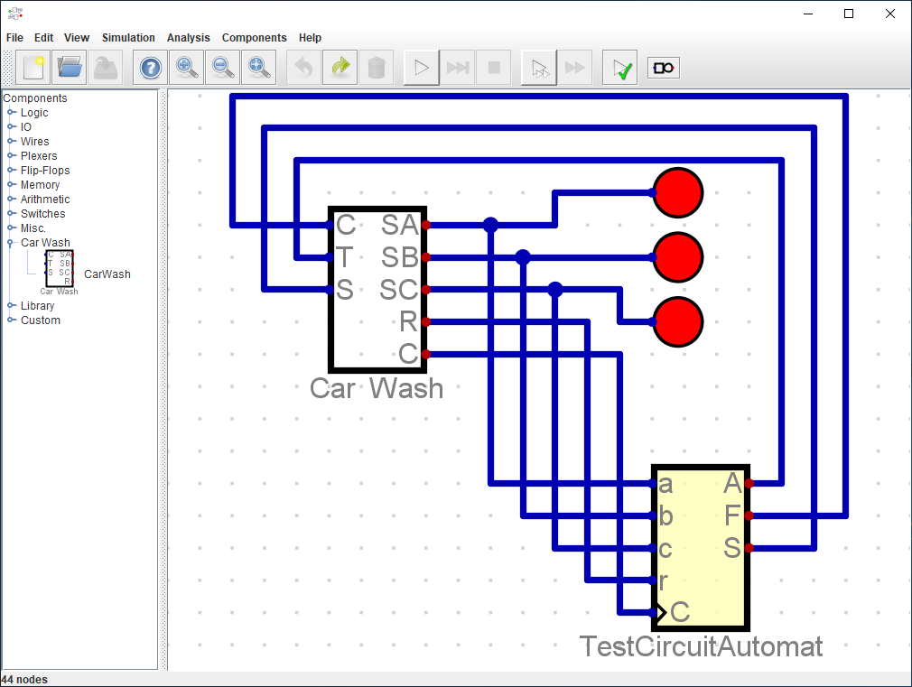

# Car wash simulation for testing  a state machine#

This is a custom component for the [Digital](https://github.com/hneemann/Digital/) simulator.
It adds a graphical car wash simulation for testing state machines wich are also designed in [Digital](https://github.com/hneemann/Digital/) .

## Its features ##

In the graphical simuation exits cars, wich interact with the different elements of the car wash, the sensors and the conveyorbelt and traffic light.
The conveyor belt, the traffic light and the siren can be toggeld over inputs from the circuit.
The three sensors act as outputs for the component. There are also a toggleable  clock and a reset output.
The clock toggles every time there is an event in the car wash simulation.

Included in the test folder are a test circuit and a state machine for testing the component

## How do I get set up? ##

The easiest way to build the necessary Jar is to use [maven](https://maven.apache.org/).

* JDK 1.8 is needed (either the Oracle JDK 1.8 or OpenJDK 1.8)  
* Clone the repository.
* Replace the `Digital.jar` which is included in this repo with the version you want to use.
* After that run `mvn install` to create the library jar file
